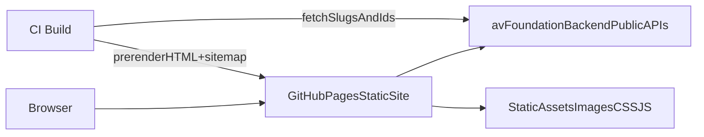

# GitHub Pages static frontend migration (Vite/React)

## Goal
- Create a new project `av-foundation-frontend-web` that runs **100% on GitHub Pages** (static hosting).
- Keep **UI + client logic consistent** with the current Next.js frontend at [`av-foundation-frontend/`](av-foundation-frontend/).
- Move/keep any **server-only** functionality behind backend **public APIs** in [`av-foundation-backend/`](av-foundation-backend/) (no frontend SSR).
- Preserve SEO **as close as possible** to current Next behavior by generating **static HTML per route** at build time and shipping `sitemap.xml`.

## Target repo + public URLs
- New repo: [`dangkhoaow/av-foundation-frontend-web`](https://github.com/dangkhoaow/av-foundation-frontend-web)
- Deployed site (CI must test this): `https://dangkhoaow.github.io/av-foundation-frontend-web/`
- Existing “reference” site for optional behavior comparison: `https://d3te863nebxng5.cloudfront.net/`

## Delivery process (Scrum-style ordering)
We will implement work in this strict order so every milestone is testable and repeatable:
1. **Documentation** (`product-*`, `tech-*` skills)
2. **Test plan** (`test-testing-plan` generates scoped ACs/testcases)
3. **Unit tests** (`test-unit-*` define inputs/expected outputs)
4. **E2E tests** (`test-e2e-*` define evidence + expected UI/network behavior)
5. **Develop** (implement only what’s covered by the current scoped test plan)
6. **Execute** (run unit + e2e via `test-runner`)
7. **Feedback loop** (auto-file GitHub issues, fix root cause, rerun runner, update issues + `tech-dev-process-implementation`)

## Agent Skills scaffolding (`av-foundation-frontend-webagent/skills/*`)
We will create a dedicated, reusable agent playbook in this workspace:
- `av-foundation-frontend-webagent/skills/` (new)

All skills must follow the Agent Skills spec at `https://agentskills.io/specification`:
- Each skill is a folder named exactly like its frontmatter `name`
- Each skill contains at minimum a `SKILL.md` with YAML frontmatter + Markdown body
- Skill names must be lowercase `a-z0-9-` only, max 64 chars, no leading/trailing `-`, no `--`

Directory template for each skill:
```text
skill-name/
├── SKILL.md
├── scripts/          # optional
├── references/       # optional
├── assets/           # optional
```

### `product-*` skills (original behavior + milestones)
Create separate reusable concerns (initial set):
- `product-original-frontend-baseline`: what the original Next.js frontend does (routes, locale behavior, SEO expectations, data sources).
- `product-migration-milestones`: epics/milestones/ACs mapped to this plan’s todos (source of truth for testing scope).

### `tech-*` skills (architecture + implementation + backend API specs)
Create separate reusable concerns (initial set):
- `tech-architecture-frontend-gh-pages`: static hosting constraints, base-path strategy, routing strategy, asset strategy.
- `tech-backend-public-api-specs`: canonical public endpoints + contracts consumed by frontend (links into [`av-foundation-backend/app/api/public/`](av-foundation-backend/app/api/public/)).
- `tech-seo-prerendering-and-sitemap`: how we generate per-route HTML/meta + `sitemap.xml` on build.
- `tech-dev-process-implementation`: **must be updated at the end of every implementation turn** with what shipped, what’s deployed, what’s missing, and what’s now testable.

### `test-*` skills (planning, unit, e2e, runner, issues)
Required core skills:
- `test-testing-plan`
  - **Inputs**:
    - this epic plan (ACs/milestones)
    - the latest `tech-dev-process-implementation` status
  - **Output**: generates a dated plan file (suffix `yyyymmdd-hhmm`) scoped to implemented items:
    - `av-foundation-frontend-webagent/skills/test-testing-plan/plans/test-plan-yyyymmdd-hhmm.md`
  - **Rule**: exclude ACs/testcases for features not implemented yet.

- `test-unit-*`
  - Unit tests (Vitest + jsdom) for helpers, API client, routing utilities, and i18n utilities.
  - Each skill defines “input → expected output” for one focused concern.

- `test-e2e-*`
  - E2E tests (Playwright) for critical user flows.
  - Each skill defines expected evidence (trace/screenshot/logs) for one focused concern.

- `test-runner`
  - Takes the latest `test-testing-plan` output as input.
  - Runs E2E tests against the deployed GH Pages site `https://dangkhoaow.github.io/av-foundation-frontend-web/`.
  - Captures browser console + network (backend API) + Playwright traces.
  - Optional: run the same scenarios against the reference site `https://d3te863nebxng5.cloudfront.net/` and attach diffs/evidence in the run report.
  - Writes dated artifacts:
    - `av-foundation-frontend-webagent/skills/test-runner/runs/test-run-yyyymmdd-hhmm.md`
    - `av-foundation-frontend-webagent/skills/test-runner/issues/issues-yyyymmdd-hhmm.md`
  - Posts/updates GitHub issues in [`dangkhoaow/av-foundation-frontend-web/issues`](https://github.com/dangkhoaow/av-foundation-frontend-web/issues).

## What’s Next.js-only today (must be replaced)
- **Locale middleware routing**: [`av-foundation-frontend/src/middleware.ts`](av-foundation-frontend/src/middleware.ts)
- **App Router layouts + metadata**: [`av-foundation-frontend/src/app/[locale]/layout.tsx`](av-foundation-frontend/src/app/[locale]/layout.tsx)
- **`next-intl` server hooks**: [`av-foundation-frontend/src/i18n/request.ts`](av-foundation-frontend/src/i18n/request.ts)
- **`next/image` optimization** in multiple components (Hero/Footer/Sidebar/Logo/FeaturedArtworks)
- **Intercepting/parallel routes (`@modal`)** for the artwork modal: [`av-foundation-frontend/src/app/[locale]/collection/@modal/**`](av-foundation-frontend/src/app/[locale]/collection/@modal/)
- **SSR data fetch for SEO** (artists/artworks detail) in:
  - [`av-foundation-frontend/src/app/[locale]/artists/[id]/page.tsx`](av-foundation-frontend/src/app/[locale]/artists/[id]/page.tsx)
  - [`av-foundation-frontend/src/app/[locale]/collection/[id]/page.tsx`](av-foundation-frontend/src/app/[locale]/collection/[id]/page.tsx)
- **Mock detail pages that must be replaced with real API**:
  - News detail: [`av-foundation-frontend/src/app/[locale]/news/[id]/page.tsx`](av-foundation-frontend/src/app/[locale]/news/[id]/page.tsx)
  - Event detail: [`av-foundation-frontend/src/app/[locale]/events/[id]/page.tsx`](av-foundation-frontend/src/app/[locale]/events/[id]/page.tsx)

## Backend public APIs already available (we’ll rely on these)
- Public content: [`av-foundation-backend/app/api/public/README.md`](av-foundation-backend/app/api/public/README.md)
- Artworks list/detail: [`av-foundation-backend/app/api/public/artworks/route.ts`](av-foundation-backend/app/api/public/artworks/route.ts), [`av-foundation-backend/app/api/public/artworks/[id]/route.ts`](av-foundation-backend/app/api/public/artworks/[id]/route.ts) (detail supports **UUID or slug/slugEn** via `findByKey`)
- Artists list/detail: [`av-foundation-backend/app/api/public/artists/route.ts`](av-foundation-backend/app/api/public/artists/route.ts), [`av-foundation-backend/app/api/public/artists/[id]/route.ts`](av-foundation-backend/app/api/public/artists/[id]/route.ts)
- Events list/detail: [`av-foundation-backend/app/api/public/events/route.ts`](av-foundation-backend/app/api/public/events/route.ts), [`av-foundation-backend/app/api/public/events/[slug]/route.ts`](av-foundation-backend/app/api/public/events/[slug]/route.ts)
- News list/detail: [`av-foundation-backend/app/api/public/news/route.ts`](av-foundation-backend/app/api/public/news/route.ts), [`av-foundation-backend/app/api/public/news/[slug]/route.ts`](av-foundation-backend/app/api/public/news/[slug]/route.ts)
- Public files (images): [`av-foundation-backend/app/api/public/file/[fileId]/route.ts`](av-foundation-backend/app/api/public/file/[fileId]/route.ts)

## Target architecture


## Implementation plan (high level)

### 1) Create the new repo skeleton (`av-foundation-frontend-web`)
- Scaffold a **Vite + React + TS** app.
- Configure GitHub Pages base path (the repo name) as required by the guide [`DEPLOY_TO_GITHUB_PAGES.md`](DEPLOY_TO_GITHUB_PAGES.md).
- Copy over **UI + assets** from:
  - Source code: [`av-foundation-frontend/src/`](av-foundation-frontend/src/)
  - Static assets: [`av-foundation-frontend/public/`](av-foundation-frontend/public/)

### 2) Routing: replace Next App Router with React Router
- Implement routes equivalent to current pages:
  - `/:locale` (home)
  - `/:locale/collection` + `/:locale/collection/:artworkKey`
  - `/:locale/artists` + `/:locale/artists/:id`
  - `/:locale/events` + `/:locale/events/:slug`
  - `/:locale/news` + `/:locale/news/:slug`
  - `/:locale/knowledge`, `/:locale/who-we-are`
- Add **default-locale redirect** (e.g. `/` → `/vi`) and ensure all internal navigation includes locale.
- Recreate the Next `@modal` behavior using the React Router “background location” modal pattern for the artwork modal.

### 3) i18n: replace `next-intl` while keeping existing messages
- Reuse current JSON messages:
  - [`av-foundation-frontend/src/messages/vi.json`](av-foundation-frontend/src/messages/vi.json)
  - [`av-foundation-frontend/src/messages/en.json`](av-foundation-frontend/src/messages/en.json)
- Implement a small `useTranslations(namespace)` + `useLocale()` layer so most components keep the same mental model as now.
- Ensure language toggle logic in components like Sidebar/Header continues to work, but uses React Router navigation instead of Next middleware.

### 4) Replace Next-only primitives with web equivalents (keep UI)
- **`next/link` → Router Link**: introduce a single `LocalizedLink` wrapper so we don’t hand-edit every `href` rule.
- **`next/navigation` hooks** → React Router hooks (`useNavigate`, `useLocation`, `useParams`, `useSearchParams`).
- **`next/image` → ``** (optionally a small `AppImage` wrapper for consistent props + lazy loading).
- **`next/font/google`** → include Inter via CSS (or self-hosted font files) while keeping typography tokens.

### 5) Data fetching rules (no mocks, no rewrites)
- Keep the existing fetch client concept from [`av-foundation-frontend/src/lib/api/client.ts`](av-foundation-frontend/src/lib/api/client.ts) but adapt env reading for Vite (`VITE_API_URL`, `VITE_IMAGE_BASE_URL`).
- Ensure all API calls go directly to backend public APIs (CORS already allowed on public routes).
- Replace mocked News/Event detail pages with real API calls:
  - News detail must call `/api/public/news/:slug`
  - Event detail must call `/api/public/events/:slug`

### 6) SEO parity strategy (recommended): build-time prerender + per-route meta
- Implement **static prerendering** so “View Page Source” contains real HTML + meta tags (closest to Next SSR on GH Pages).
- Generate static pages for:
  - All static pages for `vi` and `en`
  - All news slugs, event slugs
  - All artist IDs
  - All artwork keys (slug/slugEn/id) *within a configurable cap if data size is huge*
- Generate `sitemap.xml` at build time for the same path list (and optionally `robots.txt`).

### 7) GitHub Pages deployment (based on `DEPLOY_TO_GITHUB_PAGES.md`)
- Set correct build base path for `/av-foundation-frontend-web/`.
- Add `.nojekyll` to avoid GH Pages underscore issues (needed by many build outputs).
- Add GitHub Actions workflow to build and deploy the static output folder.

### 8) Testing & CI (unit + e2e + public-url runner)
- **Unit tests (browser-like)**:
  - Use Vitest + jsdom + Testing Library.
  - Focus on: API client, routing helpers, i18n helpers, and any non-trivial pure logic.
- **E2E tests (real browser)**:
  - Use Playwright.
  - Focus on: locale routing, key page loads, backend public API reachability from the browser, and key content flows.
- **Runner must test the deployed site URL**:
  - After each deployment to GitHub Pages, CI runs Playwright against `https://dangkhoaow.github.io/av-foundation-frontend-web/`.
  - CI waits/polls until the new deployment is live before starting tests.
  - CI uploads artifacts (traces, screenshots, console/network logs, run report).
- **Issue automation**:
  - Runner produces a dated issue list file.
  - Issue posting is supported in two execution environments:
    - **GitHub Actions**: create/update issues using GitHub API or `gh` with `GITHUB_TOKEN`.
    - **Cursor agent runs**: create/update issues using the configured GitHub MCP (`user-github`).
  - After fixes, rerun and update the issue(s) with new evidence.
  - Avoid hardcoding to “pass tests”; fixes must address root cause.

## Backend changes (only if needed)
- If prerender needs a **fast path list** (to avoid downloading heavy list payloads), add minimal public endpoints, e.g.
  - `GET /api/public/artworks/paths` → `{ id, slug, slugEn, updatedAt }[]`
  - `GET /api/public/news/paths` → `{ slug, updatedAt }[]`
  - `GET /api/public/events/paths` → `{ slug, updatedAt }[]`
  - `GET /api/public/artists/paths` → `{ id, updatedAt }[]`

## Acceptance criteria (AC)
- AC-01: Locale routing works for `vi` and `en` in all primary routes.
- AC-02: Home, Collection, Artists, Events, News, Knowledge, Who We Are render.
- AC-03: Detail pages load real data from backend public APIs.
- AC-04: Artwork detail supports both id and slug keys.
- AC-05: Public API calls function without mocks or hardcoded fallbacks.
- AC-06: Static HTML output exists for all required routes.
- AC-07: GH Pages deployment works with correct base path and assets.
- AC-08: Test runner produces dated reports and issues.

## Acceptance checklist
- All current routes render with the same layout and styles.
- No frontend SSR required; app works on pure static host.
- No mock detail pages remain (news/events details are real backend data).
- Public API integration works from GH Pages origin (CORS ok).
- `av-foundation-frontend-webagent/skills/` exists with `product-*`, `tech-*`, and `test-*` skills, and `tech-dev-process-implementation` is kept up to date each implementation turn.
- CI provides a verifiable loop on each commit to main:
  - `test-testing-plan` generates a dated, scoped test plan (`yyyymmdd-hhmm`)
  - unit tests run (Vitest)
  - e2e tests run (Playwright) against `https://dangkhoaow.github.io/av-foundation-frontend-web/`
  - artifacts uploaded (trace/screenshots/logs + run report)
  - issues filed/updated for failures in `dangkhoaow/av-foundation-frontend-web/issues` (CI via `GITHUB_TOKEN` or Cursor via MCP, depending on runner mode)
- Static output includes:
  - `index.html` per route (prerendered)
  - `sitemap.xml` (and optional `robots.txt`)
  - correct base path assets
